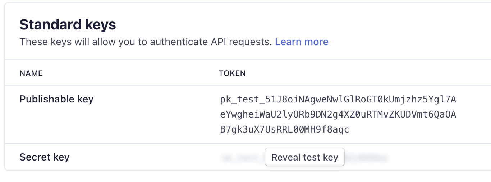
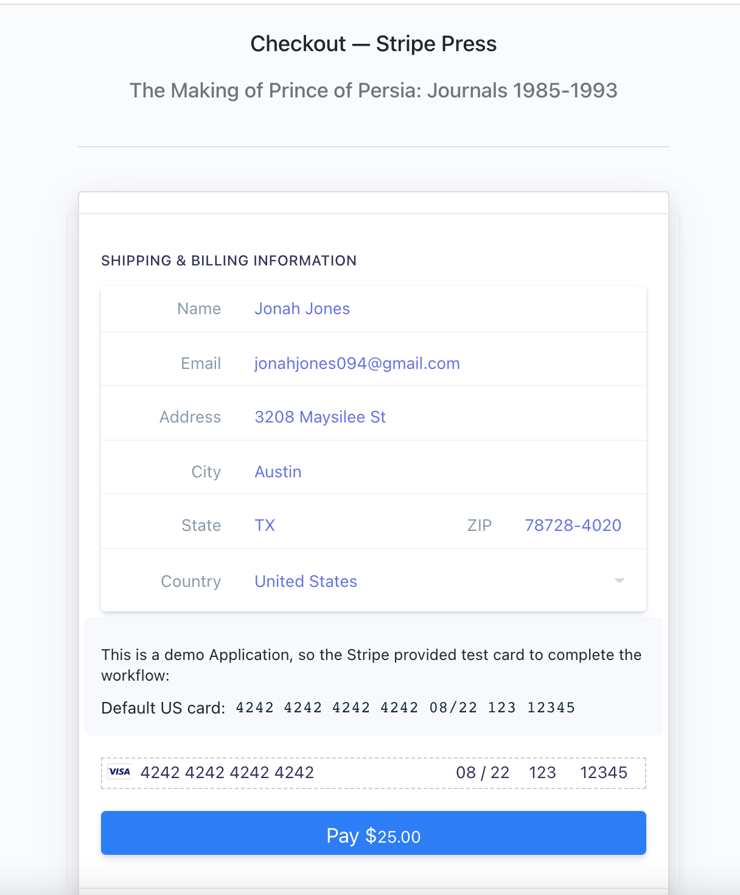

## How does it work?

Flask is a lightweight web framework for python which utilizes Werkzeug and WSGI under the hood to add useful features such as
- Async/Await
- HTTP utilities such as cache, user agents, cookies, and more
- Full featured request object
- Interactive debugger
- Threaded WSGI server 

This particular applicaion is a simple Flask application which utilzies HTML rendering and a few simple API endpoints to achieve the assignments goals of adding a Stripe element to the project.

## Setup instructions

To launch locally you first must go to `app.py` and replace the Secret key with the key from your stripe account.

Find your stripe keys in the Api Keys section of your [account](https://dashboard.stripe.com/test/apikeys)



Replace the one in the python file.

```python
stripe.api_key = "sk_test_123456"
```

It is important to **NOT** publish the secret key to github after testing

*Secret API keys should be kept confidential and only stored on your own servers. Your account’s secret API key can perform any API request to Stripe without restriction.*

From here you can simply run

```bash
flask run

#or

make run
```

Once the server is up you can browse to http://localhost:5000 to see the site


To test out the workflow of the Stripe API call you need to add a book and go to the checkout.

Once you are there you can input all your payment details such as:
- Any Name
- Any Email (It won't send real emails to you)
- A Stripe Test [Card](https://stripe.com/docs/testing)

For this example we recommend using

```bash
#Name (Anything)
Jane Doe
#Email (Anything)
sa-takehome@mail.com
#Card Number
4242424242424242
#Exp Date (Anything later than today)
8/22
#CVC (Anything)
123
#Zip Code (Anything)
12345
```



## Resources Used

Docs used to complete this project

- API [documentation](https://stripe.com/docs/api/charges/create) for create charge
- Stripe Elements Example [Repo](https://github.com/stripe/elements-examples)
- Flask [documentation](https://flask.palletsprojects.com/en/2.0.x/)

## Appcoaching the assignment

blah blah blah

## Challenges

The biggest challenge I encountered in this assignment was that `Stripe Elements` is **Only** a Javascript Library. Utilizing a JS library in flask was slightly more tricky since it had to done in the imported javascript file, but the Stripe API calls were still being executed from Flask. I'm primaraly a Go programmer, and my Javascript skills were rusty so this took a few tries to get just right.

## Extending this solution

A paragraph or two about how you might extend this if you were building a more robust instance of the same application.