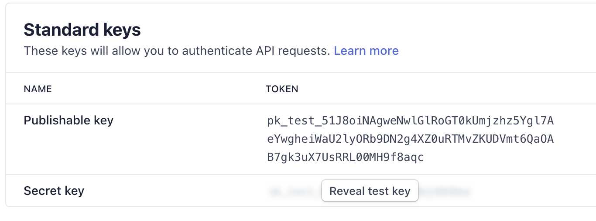
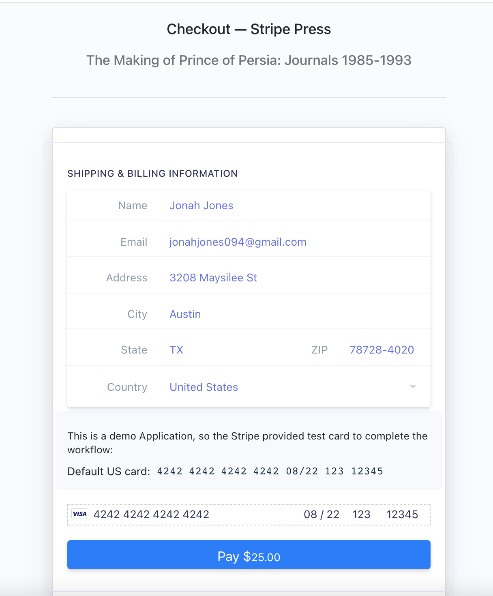

# Take home project
This is a simple e-commerce application that a customer can use to purchase a book, but it's missing the payments functionality — your goal is to integrate Stripe to get this application running!


## How does it work?

Flask is a lightweight web framework for python which utilizes Werkzeug and WSGI under the hood to add useful features such as
- Async/Await
- HTTP utilities such as cache, user agents, cookies, and more
- Full featured request object
- Interactive debugger
- Threaded WSGI server 

This particular applicaion is a simple Flask application utilzing HTML rendering and a few simple API calls to achieve the assignments goal of adding Stripe element to the existing project.

## Setup instructions

To launch locally you need to input your keys, start by going to `app.py` and replacing the Secret key with the secret key from your stripe account. 

Afterwards replace the publishable key in the javascript file. This is required otherwise the application will error letting you know keypair is not matching.

Find your stripe keys in the Api Keys section of your [account](https://dashboard.stripe.com/test/apikeys)



Replace this string in the python file with your actual secret key. 

```python
#app.py
stripe.api_key = "sk_test_123456"
```

Replace this string in the javascript file with your actual Publishable Key.

```javascript
//static/js/custom.js
 var stripe = Stripe(
  "pk_test_123456"
);
```

It is important to **NOT** publish the secret key to github after testing.

*Secret API keys should be kept confidential and only stored on your own servers. Your account’s secret API key can perform any API request to Stripe without restriction.*

From here you can simply run

```bash
flask run

#or

make run
```

Once the server is up you can browse to http://localhost:5000 to see the site


To test out the workflow of the Stripe API call you need to add a book and go to the checkout.

Once you are there you can input all your payment details. This application does not do address validation, so any valid input will suffice.

There is on-screen instructions for inputting a stripe test card in the CC input field, and you can find the full list of test [cards](https://stripe.com/docs/testing) here.





## Resources Used

Docs used to complete this project

- API [documentation](https://stripe.com/docs/api/charges/create) for create charge
- Stripe Elements Example [Repo](https://github.com/stripe/elements-examples)
- Flask [documentation](https://flask.palletsprojects.com/en/2.0.x/)
- Google

## Appcoaching the assignment

At first glance this assignment wanted 2 things

- Stripe Elements
- Charge API call

The Stripe elements was trail and error, since it was writing javascript and HTML templates. See more info in the [Challenges](##Challenges) section.

I Worked backwards from a desired state the Charge API call, by implementing a charge known good API call, and the subsequent [success.html](views/success.html) screen displaying the **Charge ID** to the customer. Once this worked I made sure the input fiels from the elements replaced the hard-coded values from testing.

Their was only a few design desicions to made due to the scope of the app. The largest being:

- Should the Stripe charge api call be made client or server side?

Making this client side would have been easier since the javascript was already calling in the Stripe Elements, however following architectual best practices such as Data Access Object (DAO) Pattern leads us to implementing the charge server side via flask. In addiation there is a dozen other capabilities/benefits that are helping by adding this server side (Latency to DB, Queueing, Caching).

## Challenges

The biggest challenge I encountered in this assignment was that `Stripe Elements` is **Only** a Javascript Library. Utilizing a JS library in flask was slightly tricky since it had to done in the imported javascript file. I'm primaraly a Go programmer in my current role, and my Javascript skills were rusty so this took a few tries/tweaks to get just right.

## Extending this solution

If my assignment was to extend this app, I would utilize several design desicions, and technologies to help achieve that listed below. We have a checklist we follow at AWS when building/releasing new services, and most companies follow that same pattern. That being said this design-list is purely based off a new application stack with 0 limitations.

### Laungauge
- Switch to Golang for better CPU effenciny with Goroutines
- Swith the Frontend HTML to React

Go is my strogest launguage, so building this more robustly I would swap out the Python, and JS templates with Go/React.

### Data
- Database (Mongo/Postgres)
- Caching 
- Queueing
- CDN

- A database would be utilized to store/validate customer details and save expensive API calls back and forth through stripe. Would use a seperate PCI Database if storing CC information, or not store CC at all.

Utilizing several forms of caching such as a read-through Cache in the frontend for heavily read accessed content such as objects/lookup deatils.

A write-through cache in front of the Database for storing/accessing customer information.

CDN to regionally cache assets such as pictures/javascript.


Queuing between frontend/backend to decouple direct API calls, and implement a fan out queue for new users (Storing information in Database, sending verification email, and other actions)

I would also indepently scale the backend service via queue depth, and the frontend via active sessions (users).

### Observability
- Logging
- Monitoring
- Tracing

I would implement OTEL collector + Prometheus/Loki stack or whatever commercial tool my company currently has in place as it's standard.

### Security
- Mutual TLS
- Stripe Webhook validation
- Zip Code Credit Card Validation method/function to stripe
- Authenication

Any application handling PCI data needs adequete securtiy mechanisms in place. 

This includes mutual TLS between services handling CC data. Using Stripe Webhook validation to check the signature of the stripe library before executing API calls. Cross Checking the Zip code input matches the CC on file, before executing bad charges.

### Network
- Load balancer
- Reverse Proxy/Service Mesh

Add scalability/security mechanisms to help manage connections/cookies, and further enable more advanced deployment mechanism such as canary deployments for the application.